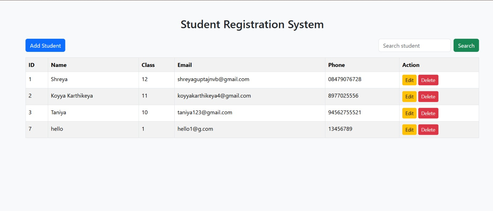
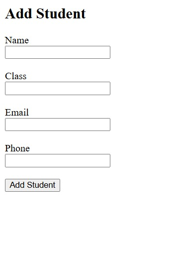
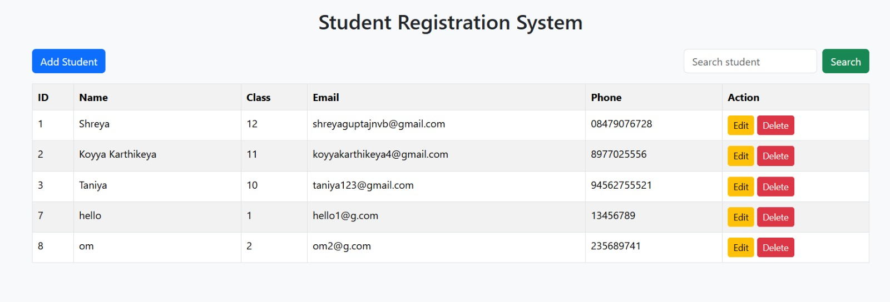

# Student Registration System

A simple Student Registration System built using PHP and MySQL.

## Features

- Add Student
- View Students
- Edit Student Details
- Delete Student
- Search Students
- Bootstrap Responsive UI

## Technologies Used

- PHP
- MySQL
- Bootstrap
- HTML
- XAMPP

## Screenshots

### Student List Page

### Add Student Page

### Search Feature

## Setup Instructions

1. Install XAMPP
2. Start Apache and MySQL
3. Import database.sql into phpMyAdmin
4. Place project inside htdocs folder
5. Open browser and go to:

http://localhost/student_registration_system
